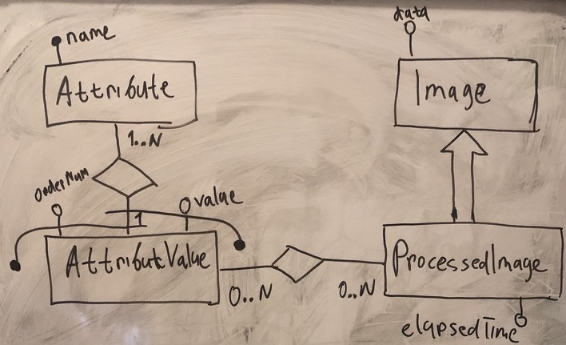
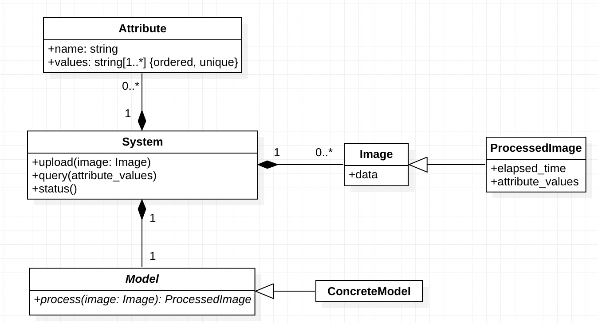

# Анализ

## ER модель



### Сущности

* `Attribute` - характеристика, которая может использоваться как критерий при распознавании
    * `name: string not null` - название характеристики
* `AttributeValue` - значение характеристики
    * `value: string not null` - возможное значение соответствующей характеристики
    * `orderNum: integer not null` - порядок значения
* `Image` - изображение
    * `data: blob not null` - данные изображения
* `ProcessedImage` - обработанное изображение
    * `elapsedSeconds: real not null` - время (в секундах) затраченное на обработку.

### Дополнительные ограничения

1. Каждое обработанное изображение может иметь только одно значение для каждой характеристики.
```
forall
  i, a, v1, v2
(
  AttributeValue(a, v1) ∧ imageAttributeValue(i, v1)
  ∧
  AttributeValue(a, v2) ∧ imageAttributeValue(i, v2)
)
->
(
  v1 = v2
)
```
2. Каждое обработанное изображение должно иметь значение для каждой характеристики.
```
forall
  i, a
(
  ProcessedImage(i) ∧ Attribute(a)
)
->
(
  exists
    v
  AttributeValue (a, v) ∧ imageAttributeValue(i, v)
)
```

## Диаграмма классов



### `System`

Методы этого класса отвечают за реализацию сценариев использования системы (см. Use Case модель).

### `Attribute`

Характеристика изображения.

### `Image`

Изображение.

### `ProcessedImage`

Обработанное изображение, содержащее значения для характеристик.

### `Model` и `ConcreteModel`

Каждое загруженное изображение, система должна обработать используя модель для распознавания.

Наследники абстрактного класса `Model` (модель для распознавания) реализуют его абстрактный метод `process()`,
который берёт на вход изображение (`Image`) и возвращает обработанное изображение (`ProcessedImage`).
